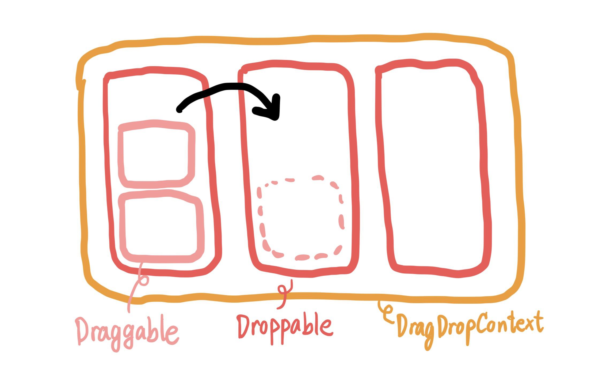
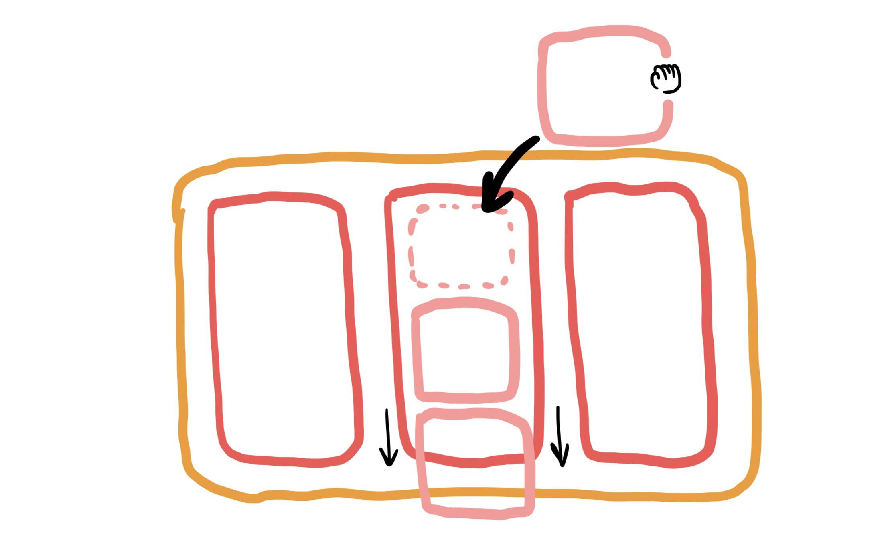

Embarking on the endeavor to craft my own rendition of the [Primetrics Towers Game](https://github.com/photkosee/react-pymetrics-towers), I aspired to elevate the user experience through the integration of a drag-and-drop feature. In the course of my exploration, I came across React Beautiful DnD, recognizing its potential to streamline the implementation process. As expected, it seamlessly delivered an effortlessly smooth dragging experience with minimal coding efforts—merely necessitating the specification of a `DragDropContext` for the desired area and a `Droppable` for the intended drop zone.

In my initial design, I effectively regulated the number of items within a `Droppable` object by incorporating a conditional check within the `isDropDisabled` property, as demonstrated in the following TypeScript code snippet:

```
const isDroppable = (towerIndex: number, blockIndex: number) => {
  return towers[towerIndex].blocks.length <= blockIndex;
};
```

> Initial design:


Nevertheless, a challenge presented itself when the `Draggable` items within the `Droppable` area exhibited an animated movement to accommodate incoming items. This behavior, inherent in the library as a fundamental feature, did not align with my vision of a stationary tower. Despite my efforts, customizing this aspect proved impractical due to its integral role in providing a "beautiful and natural movement of items."

> Natural movement:


Considering alternative libraries, I explored React DnD and, upon witnessing the [chess board demo](https://react-dnd.github.io/react-dnd/docs/tutorial), discerned that my preferred approach involved adhering to React Beautiful DnD. I chose to refine my strategy by dividing the `Droppable` area and restricting the number of `Draggable` items within each zone to one.

> Final design:


In conclusion, it became evident that React Beautiful DnD excels in delivering a captivating and natural item movement, making it an invaluable tool for those seeking to implement a Trello-like board with standard drag-and-drop functionality. While the library may have limitations in terms of precise customization, my journey experimenting with a new library was both educational and enjoyable. I invite you to explore and experience my game, [Primetrics Towers Game](https://github.com/photkosee/react-pymetrics-towers).
